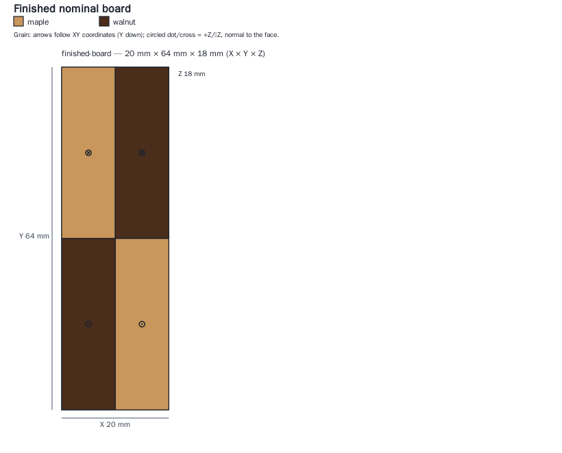
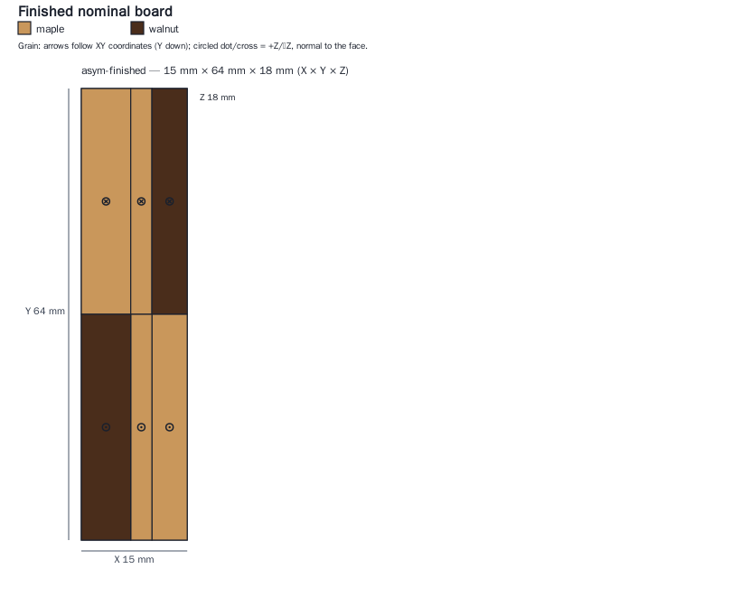
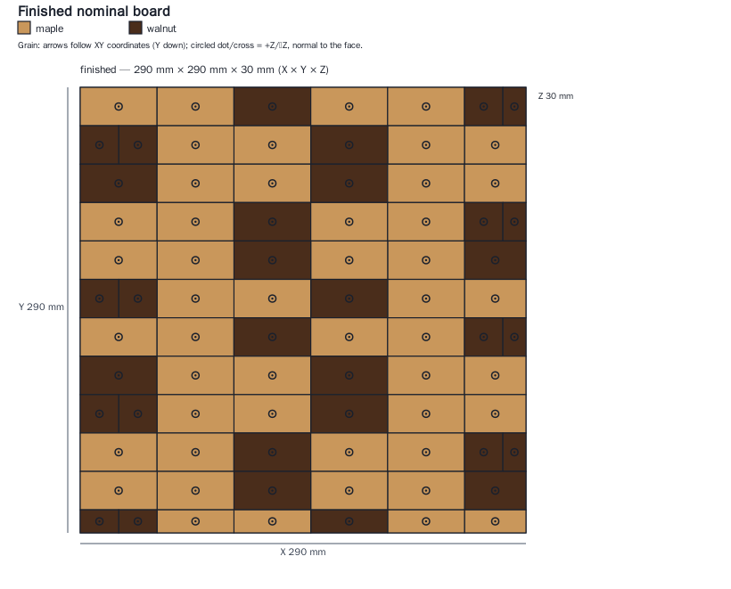

# cbdesign

`cbdesign` is an executable, **nominal-only** replay and accounting prototype for hand-authored two-species end-grain cutting-board plans. N1 adds rough-stock preparation and required shop profiles; legacy M1 prepared-strip plans remain supported. It does not yet generate recipes or optimize stock layouts.

It independently reconstructs strict versioned JSON plans from finite stock boxes; replays full-span cuts, face-specific removals, proper rigid rotations, and ordered full-face glue-ups; preserves species/grain/source provenance; enforces the restricted two-species, two-stage intact-slice construction template; and produces an exact per-species material ledger plus SVG views.

## Implementation plan

Read the **[full implementation roadmap](docs/implementation-roadmap.md)** for the next three milestones, concrete work packages, acceptance gates, and future tolerance/UI/physical-validation work.

1. **N1:** nominal rough-stock fabrication foundation and CI configuration (implemented; physical review remains separate).
2. **N2:** generate complete plans from explicit binary grids.
3. **N3:** approximate patterns under recipe budgets and compare trade-offs.

## Install and run

Python 3.12+ is required. Use a project-local environment:

```bash
python3 -m venv .venv
.venv/bin/pip install -e '.[test]'
.venv/bin/python -m cbdesign validate examples/checkerboard.json --output /tmp/checkerboard
.venv/bin/python -m cbdesign validate examples/asymmetric-board.json --output /tmp/asymmetric
.venv/bin/python -m cbdesign validate examples/rough-stock-board.json --output /tmp/rough-stock
.venv/bin/pytest
```

The CLI writes `validation.json`, `material-ledger.json`, `board.svg`, `panels.svg`, `stock.svg`, and `operations.txt`. It refuses to overwrite an output directory unless `--overwrite` is supplied, and does not write success artifacts after failed replay.

## Visual smoke tests

These are tiny synthetic geometry fixtures, **not full-size shop-ready board designs**. Images below are generated by the real CLI from the checked-in example plans; thin lines show physical region boundaries, including same-species joins.

| Reversed-row checkerboard — 20 × 64 × 18 mm | Asymmetric, saw-trimmed board — 15 × 64 × 18 mm |
| --- | --- |
|  |  |

First-stage panels: [checkerboard](docs/previews/checkerboard/panels.png) · [asymmetric](docs/previews/asymmetric-board/panels.png).

Inspect the generated [checkerboard reports](docs/previews/checkerboard/) or [asymmetric reports](docs/previews/asymmetric-board/) for SVGs, operation lists, validation coverage, and exact material ledgers.

To regenerate the tracked report bundles:

```bash
.venv/bin/python -m cbdesign validate examples/checkerboard.json --output docs/previews/checkerboard --overwrite
.venv/bin/python -m cbdesign validate examples/asymmetric-board.json --output docs/previews/asymmetric-board --overwrite
```

PNG snapshots additionally use the optional preview tool `cairosvg` (not a runtime dependency):

```bash
.venv/bin/pip install cairosvg
.venv/bin/python -c 'from pathlib import Path; import cairosvg; [cairosvg.svg2png(url=str(p), write_to=str(p.with_suffix(".png")), background_color="white", output_width=900) for p in Path("docs/previews").glob("*/*.svg")]'
```

## Rough-stock reference

The [v2 reference plan](examples/rough-stock-board.json) starts with six maple and four walnut finite rough segments of unequal cross-sections. It records both end trims, thickness/edge preparation, explicit rips and fresh-face jointing, three physical panels across two visual recipes, twelve normal/reversed rows, slicing reserves, and final finishing/trim.

**Finished size: 290 × 290 × 30 mm.** The independent [dimension chain and per-species ledger](docs/decisions/0002-rough-stock-contract.md) expect 54 saw passes, 17 first-stage joints, and 11 final-row joints. Same-species physical subdivisions remain visible even inside one visual run.



[Panels](docs/previews/rough-stock-board/panels.png) · [Stock breakdown](docs/previews/rough-stock-board/stock.svg) · [Reports](docs/previews/rough-stock-board/). Stock diagrams show exploded source-Z layers, not overlapping material counted twice. All shop settings are illustrative; this is not a fabrication certificate.

Regenerate all bundles with `.venv/bin/python scripts/regenerate_previews.py`; add `--png` with CairoSVG installed to update raster previews. The [CI workflow](.github/workflows/tests.yml) configures tests, wheel build and CLI smoke runs for Python 3.12 and 3.13; a checked-in workflow is not evidence of a successful remote run.

## Version-specific validation boundary

A `nominal_valid` result means the recorded plan passed exact nominal geometry, declared-profile, provenance partition, terminal-disposition, final-dimension, end-grain, and version-specific construction checks. It is **not** a fabrication certificate, machine instruction, safety assessment, joint-strength assessment, or actual-dimension guarantee. Interval/tolerance uncertainty propagation is not implemented; neither schema accepts uncertainty bounds.

- **V1:** the tiny checkerboard/asymmetric fixtures begin with prepared strips. Optional saw-kerf, workpiece-capacity and slice-length checks are reported as passed only when supplied. Handling minima, slicing reserves and rough preparation remain explicitly `not_evaluated` for this version.
- **V2:** the rough-stock fixture requires stock types, finite source separation, six-face preparation allowances, stage-specific kerfs/feed minima/capacities, slicing reserves, supported surfacing processes, and independent physical-panel/visual-cell metadata. Missing required fields fail schema validation; declaration alone cannot establish prepared faces.

Synthetic examples and profiles are examples only, not universal safe defaults. Final end-grain finishing must use a declared supported process; no ordinary planer suitability is assumed.

See [plan format](docs/plan-format.md), [fabrication model](docs/fabrication-model.md), and [acceptance criteria](docs/acceptance-and-validation.md).

## Deferred scope

M1 deliberately excludes optimizer/recipe generation, bitmap preprocessing, UI, finite-inventory/purchasing optimization, probabilistic tolerances, uncertainty propagation, physical review, and any safety certification.
