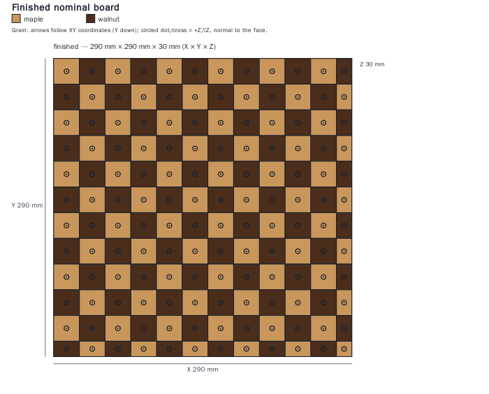
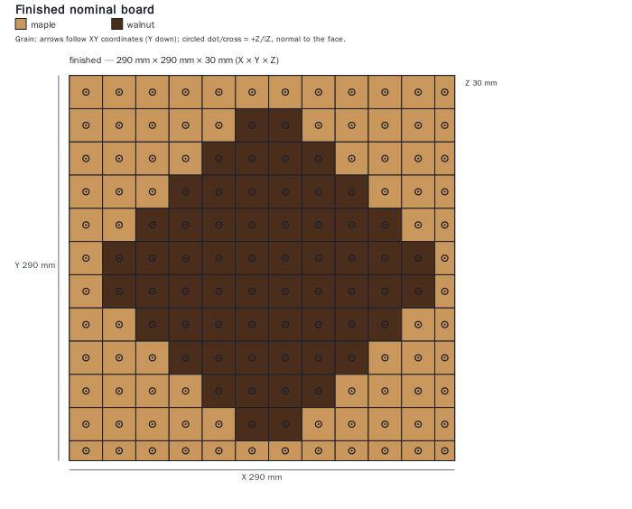
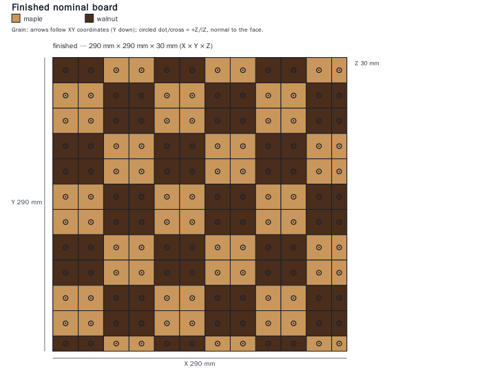
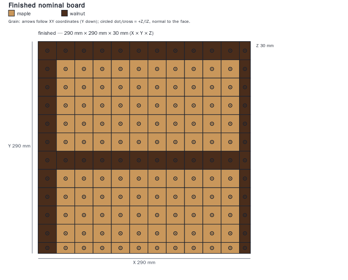
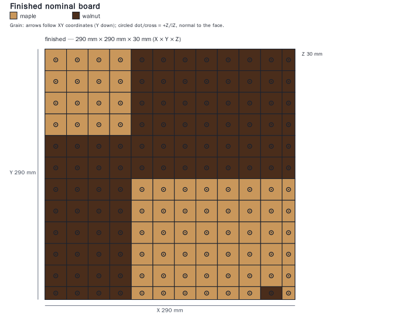
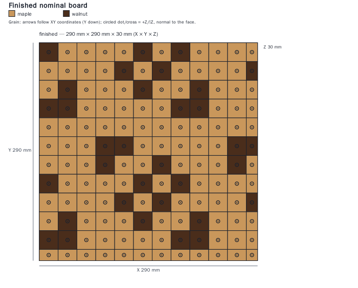
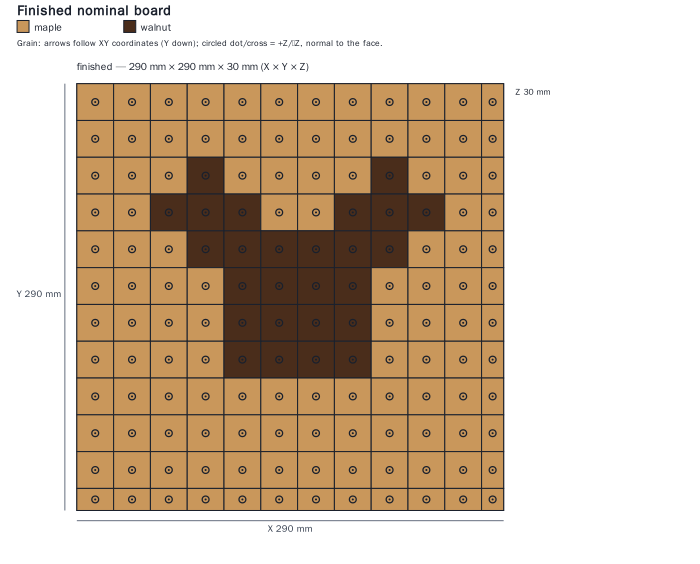
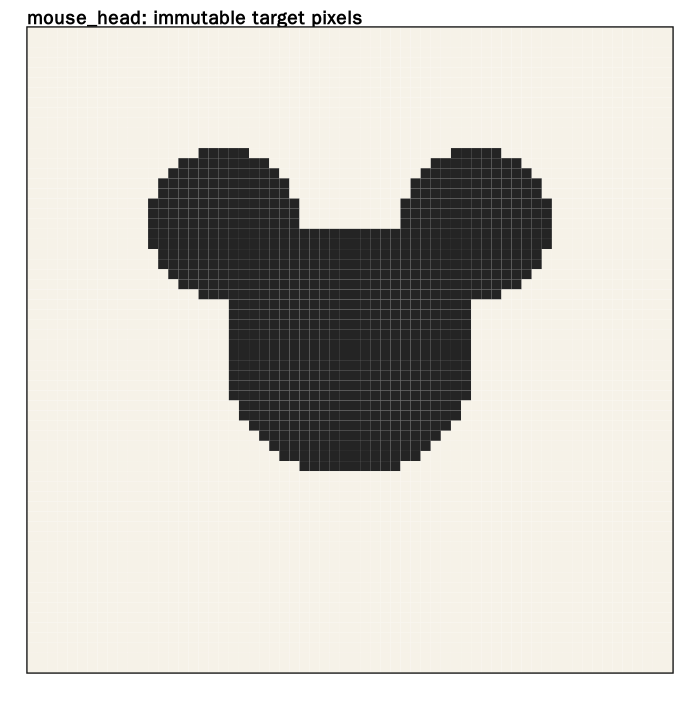
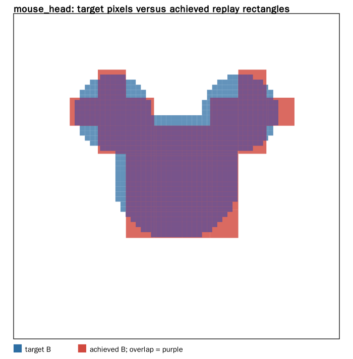

# Reproducible pattern gallery

This directory is generated by `scripts/regenerate_gallery.py`. The gallery uses illustrative nominal maple/walnut requests only; it is not a stock order, a shop setup, or a safety certificate.

## Regeneration

```bash
.venv/bin/python scripts/regenerate_gallery.py --write-fixtures --regenerate
```

The immutable inputs are in `examples/designs/`: common 12×12 targets/requests and a 64×64 PNG-derived three-circle `mouse_head` target. Each selected gallery directory contains the frozen request and target, `target.svg`, physical `achieved.svg`, target/physical-rectangle `difference.svg`, a selected replay-validated plan, and raw measured `metrics.json`.

`metrics.json` retains every requested recipe budget (1, 2, 4, 8), elapsed wall time, attempted/compiled/rejected counts, termination, candidate count, score, recipe families, and replay-derived stock/saw/joint metrics. A failed or work-bounded run is reported as such; it is never evidence that no possible fabrication exists.

The target and achieved views are intentionally separate. Target pixels cover the exact finished rectangle. The difference view shows desired B material in blue, achieved B in red, and agreement in purple. Exact compilation reproduces the **pre-trim grid**, not necessarily a zero-error finished-rectangle bitmap: this explains nonzero mismatch even for regular stripes/checkerboards.

## Preview gallery

| Checkerboard | Stripes | Diamond | Basket weave |
|---|---|---|---|
|  |  |  |  |

| Block letter | Asymmetric | Unrelated rows | Mouse head |
|---|---|---|---|
|  |  |  |  |

### Mouse target and achieved difference

| Frozen target | Actual mismatch |
|---|---|
|  |  |

[Selected executable plan](mouse_head/selected-plan.json) · [PDF report](mouse_head/report.pdf) · [Operations CSV](mouse_head/operations.csv) · [Material CSV](mouse_head/material.csv) · [Raw benchmark metrics](metrics.json).

For the 64×64 mouse target, selected mismatch drops from about **19.78% at K=1** to **9.42% at K=2**, **5.58% at K=4**, and **4.80% at K=8**. This is a bounded heuristic, not a global optimum; a higher budget does not guarantee every individual heuristic proposal improves. Whole-cell strip allocation is deliberately conservative and wasteful.

Exact compile records and searches include measured runtime. Timing values naturally change between runs; frozen requests, targets and deterministic plans are the reproducible content. Install optional `cairosvg` and append `--png` to regenerate the displayed PNGs. The mouse PDF/CSV exports regenerate with `--regenerate`.
